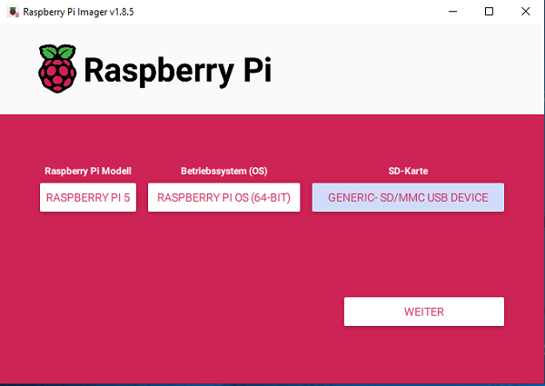

 
<a name="oben"></a>

<div align="center">

# Personen erkennen mit OpenCV


|[:skull:ISSUE](https://github.com/KI4kids/02_KI4Kids_Face/issues?q=is%3Aissue)|[:speech_balloon: Forum /Discussion](https://github.com/KI4kids/02_KI4Kids_Face/discussions)|[:grey_question:WiKi](https://github.com/KI4kids/02_KI4Kids_Face/blob/main/wiki.md)|
|--|--|--|
| | | | 
| <a href="https://github.com/KI4kids/02_KI4Kids_Face/pulse" alt="Activity">| <a href="https://github.com/KI4kids/02_KI4Kids_Face/graphs/traffic">  |<a href="https://github.com/frankyhub?tab=stars"> |


</div>


## Story
Künstliche Intelligenz (KI) bezeichnet die Fähigkeit von Maschinen, menschenähnliche Intelligenzleistungen zu erbringen. Das umfasst das Lernen aus Erfahrungen, das Verstehen von Sprache, das Treffen von Entscheidungen und das Lösen komplexer Probleme. Im Wesentlichen geht es darum, Computer so zu programmieren, dass sie Aufgaben erledigen können, die normalerweise menschliche Intelligenz erfordern.
Dieses Repo beschreibt die Gesichtserkennung mit einer KI. KI-Gesichtserkennung ist ein Teil des Fablab Oberland Bildungsprogramms. Ziel ist es, einen Datensatz zu erstellen und anschließend zu trainieren um Gesichter und Personen zu erkennen.

Gesichtserkennung ist eine Kategorie von biometrischer Software, die Personen anhand ihrer Gesichter identifiziert. Das Gesicht wird von einer Digitalkamera erfasst, das System trainiert und ist dann in der Lage die Person zu identifizieren.

Face_recognition ist eine Bibliothek zur Gesichtserkennung in Python. Sie basiert auf modernen Deep-Learning-Algorithmen und ermöglicht es, Gesichter in Bildern oder Videos zu erkennen und zu identifizieren.

OpenCV (Open Source Computer Vision Library) ist eine Open-Source-Softwarebibliothek für Computer und maschinelles Lernen. OpenCV wurde entwickelt, um eine gemeinsame Infrastruktur für Computer-Vision-Anwendungen bereitzustellen und den Einsatz von maschineller Wahrnehmung in den kommerziellen Produkten zu beschleunigen. Es verfügt über C++-, Python- und Java-Schnittstellen und unterstützt Windows, Linux, Mac OS, iOS und Android. Dieses Projekt wurde mit der "Open Source Computer Vision Library", der OpenCV, auf einem Raspbarry PI erstellt.


## Ablauf

- Vorbereitung
    - Anaconda installieren
    - Ein Environment installieren
    - OpenCV installieren
    - Kamera testen
- OpenCV Beispiele
- Eine Gesichtserkennung programmieren
- Datenerfassung (makedata.py)
- System Training (trainer.py)
- Gesichtserkennung (detector.py)
- Wie arbeitet ein neuronales Netz?


<!---

## Vorbereitung

## Raspberry Pi Imager

[Link](https://www.raspberrypi.com/software/)




## EEPROM Updade

Versionskontrolle
```
sudo rpi-eeprom-update
```

Update ausführen
```
sudo rpi-eeprom-update -d -a
```

## Ubuntu – Update und Upgrade

Bash (Bourne Again Shell) ist die freie und erweiterte Version der Bourne-Shell, die zu den Betriebssystemen Linux und GNU gehört.

Superuser Do (sudo), Advanced Package Tool (APT)

bash
```sh
sudo apt update && sudo apt upgrade -y
```
--->


## Linux Standard Base - Versionsabfrage
bash

```
lsb_release -a
```

| | |
|--|--|
|Distributor ID: | Debian|
|Description:|Debian GNU/Linux 12 (bookworm)|
|Relaese:|12|
|Codename:|bookworm|
| | |

---

## Anaconda 

Anaconda ist eine Python-Distribution für Datenverarbeitung von großen Mengen, vorhersagende Analyse und wissenschaftliche Berechnungen. Bestandteile des Anaconda Pakets sind NumPy, SciPy, matplotlib, pandas, IPython, Jupyter Notebook, scikit-learn und der Bibliothek Intel MKL.

### Versions-Kontrolle: https://repo.anaconda.com/archive/


### Anaconda installieren

bash
```sh
wget https://repo.anaconda.com/archive/Anaconda3-2025.06-0-Linux-aarch64.sh
```

cd tmp

bash
```sh
sh Anaconda3-2025.06-0-Linux-aarch64.sh
```

- press ENTER to continue
- q (Lizenzvereinbarungen mit q Abbrechen)
- yes (Installation in /home/khf/anaconda3)
- enter (Installing base environment)
- yes (running conda)


```diff

! *** Die Shell neu starten *** !

```


Ist Anaconda korrekt installiert?

bash

```
conda --version

```

Kontrolle:

conda 25.5.1

(base) khf@pi:~/temp $

---

### Python kontrollieren:

bash

```
python --version 
```
Python 3.13.5 

---
## Virtual Environments in Anaconda (Virtuelle Umgebungen) 

In der Softwareentwicklung, besonders in Python, gibt es den Begriff der virtuellen Umgebung oder virtual environment. Das ist eine isolierte Umgebung, in der du Software-Bibliotheken installieren kannst, ohne die globale Installation von Bibliotheken auf deinem System zu verändern. Dies ist besonders nützlich, um Versionskonflikte zwischen verschiedenen Projekten zu vermeiden.

### Das Environment face installieren

bash

```
conda env list
```

```
conda create -n face
```

```
conda activate face
```

```
conda env list
```

### So könnte man das Environment face wieder löschen

```
conda remove -n face --all
```
---
---
## Modelle und Datensätze

### Modelle
- yolo von Ultralytics
- OpenCV von Intel
- Pytorch  wurde von Meta AI (ehemals Facebook AI Research Lab) entwickelt seit 2017 Open source
- keras von google, jetzt Open source 
- TensorFlow von google

### Datensätze
- coco von Ultralytics
- kaggle von google 
- aws von Amazon web Service
- Open X-Embodiment Dataset und 
- Open-Physical-Interaction Dataset Collection von NVIDIA


--- 

### USB-Kamera testen

Der Code erfasst den Videostream, der von der Kamera generiert wird, und zeigt sowohl im BGR-Farb- als auch im Graumodus an. Mit q wird er beendet.

```
cd
```
```
mkdir camtest
```
```
cd camtest
```


```
# camtest.py
# Video mit der USB-Kamera

import numpy as np
import cv2

cap = cv2.VideoCapture(0)

while(True):
    # Bild für Bild erfassen
    ret, frame = cap.read()

    # Die Bilder im Frame
    gray = cv2.cvtColor(frame, cv2.COLOR_BGR2GRAY)
   
    # Zeige den Frame an
    cv2.imshow('frame',frame)  #In Farbe
    #cv2.imshow('gray',gray)    #In SW

    if cv2.waitKey(20) & 0xFF == ord('q'):
        break

# Programm beenden
cap.release()
cv2.destroyAllWindows()

```

```
python camtest.py
```

```diff

! *** Der camtest funktioniert nicht, da OpenCV noch nicht installiert ist *** !

```
### OpenCV 

OpenCV (Open Source Computer Vision Library) wurde ursprünglich von Intel im Jahr 1999 initiiert und ist seitdem zu einer der beliebtesten Bibliotheken für Computer Vision geworden. 
Die Bibliothek wurde entwickelt, um Forschern und Entwicklern eine einfache und effiziente Möglichkeit zu bieten, Computer Vision in Echtzeitanwendungen zu integrieren.
So wurde OpenCV ein beliebtes und umfassende Model für Computervisionsaufgaben und bietet eine Vielzahl von Tools und Algorithmen für die Bild- und Videoverarbeitung, Objekterkennung und Gesichtserkennung.


pip Installer

pip install ist ein Befehl, der im Python-Paketmanager pip verwendet wird, um Python-Pakete aus dem Python Package Index (PyPI) oder anderen Quellen zu installieren. Im Wesentlichen ermöglicht er die Installation, Aktualisierung und Verwaltung von Python-Softwarepaketen.


```
conda install anaconda::pip

```
OpenCV Standardpaket installieren

```
pip install opencv-python
```

Zusätzliche OpenCV Funktionen installieren

```
pip install opencv-contrib-python
```

### USB-Cam testen
```
python camtest.py
```

### Das Environment testen

```
conda deactivate
```

```
conda activate 
```

```
cd camtest
```

```
python camtest.py
```

```diff

! *** Der camtest funktioniert nicht, da OpenCV im base Environment noch nicht installiert ist *** !

```


### Das face Environment aktivieren


```
conda activate face
```
```
python camtest.py
```


## Face Detection mit OpenCV und Haarcascade

Die Haarcascade_frontalface_default.xml-Datei ist ein vortrainiertes Modell, das von OpenCV zur Gesichtserkennung bereitgestellt wird. Diese Datei enthält die Daten, die erforderlich sind, um Gesichter in Bildern mithilfe des Cascade-Klassifikators zu erkennen. Der Haarcascade-Klassifikator ist eine effektive Methode zur Objekterkennung, die von Alfred Haar 1909 entwickelt und von Paul Viola sowie Michael Jones in ihrem Papier von 2001 mit dem Titel "Schnelle Objekterkennung mittels eines verstärkten Cascades einfacher Merkmale" vorgeschlagen wurde.


Lade die benötigten Modelle

<!---
```
git clone https://github.com/KI4kids/face.git ~/person
```
--->

Python

```
#dlface.py

import os
import shutil
import urllib.request
import zipfile

# Wechsle in das Home-Verzeichnis 
os.chdir(os.path.expanduser("~"))

# Erstelle den Ordner  face
os.makedirs("face", exist_ok=True)

# Wechsle in das Home-Verzeichnis 
os.chdir(os.path.expanduser("~"))


# Wechsle in den Ordner
os.chdir("face")

# Hilfsfunktion zum Herunterladen von Dateien
def download_file(url, filename=None):
    if not filename:
        filename = url.split("/")[-1]
    print(f"Downloading {filename} ...")
    urllib.request.urlretrieve(url, filename)

# Hilfsfunktion zum Entpacken und Löschen von ZIP-Dateien
def unzip_and_remove(zip_filename):
    print(f"Unzipping {zip_filename} ...")
    with zipfile.ZipFile(zip_filename, 'r') as zip_ref:
        zip_ref.extractall(".")
    os.remove(zip_filename)

download_file("https://frankyhub.de/KI_face/face.zip")
unzip_and_remove("face.zip")

download_file("https://frankyhub.de/KI_face/single-person.jpg")

download_file("https://frankyhub.de/KI_face/klasse.jpg")

download_file("https://frankyhub.de/KI_face/group-of-people.jpg")

# Zeige den Inhalt des aktuellen Verzeichnisses
print("Inhalt von face:")
print(os.listdir("."))

# Wechsle in das Home-Verzeichnis 
os.chdir(os.path.expanduser("~"))
```


Python

### Face Detection mit Bilder

Kontrolliere ob sich die Bilder single-person.jpg und group-of-people.jpg in dein Arbeitsverseichnis befinden

```
# facedetect.py

import cv2

# Lade das Bild
image_path = "/home/khf/face/single-person.jpg"
#image_path = "/home/khf/face/group-of-people.jpg"
image = cv2.imread(image_path)

if image is None:
    print(f"Fehler: Bild '{image_path}' konnte nicht geladen werden.")
    exit()

# Lade das Haarcascade-Modell für Gesichtserkennung
# Dieses XML-Modell wird mit OpenCV mitgeliefert
cascade_path = cv2.data.haarcascades + "haarcascade_frontalface_default.xml"
face_cascade = cv2.CascadeClassifier(cascade_path)

# Bild in Graustufen umwandeln (erforderlich für Haarcascades)
gray = cv2.cvtColor(image, cv2.COLOR_BGR2GRAY)

# Gesichter erkennen
faces = face_cascade.detectMultiScale(gray, scaleFactor=1.1, minNeighbors=5, minSize=(30, 30))

print(f"{len(faces)} Gesicht(er) erkannt.")

# Rechtecke um erkannte Gesichter zeichnen
for (x, y, w, h) in faces:
    cv2.rectangle(image, (x, y), (x+w, y+h), (0, 255, 0), 2)

# Bild anzeigen
cv2.imshow("Gesichtserkennung", image)
cv2.waitKey(0)
cv2.destroyAllWindows()
```


### Face Detection mit colab

[](https://colab.research.google.com/drive/1DtwjOQWl8N34JyUxtT3rPST7t50pBj1n#scrollTo=LX67m8ihah9F)


### Face Detection mit der Kamera

```
#camface.py


import cv2

# Initialisiere Webcam
kamera = cv2.VideoCapture(0)

# Lade Haar-Cascade
gesichts_cascade = cv2.CascadeClassifier(cv2.data.haarcascades + "haarcascade_frontalface_default.xml")

while True:
    erfolg, frame = kamera.read()
    if not erfolg:
        break

    grau = cv2.cvtColor(frame, cv2.COLOR_BGR2GRAY)
    gesichter = gesichts_cascade.detectMultiScale(grau, scaleFactor=1.1, minNeighbors=5)

    for (x, y, w, h) in gesichter:
        cv2.rectangle(frame, (x, y), (x + w, y + h), (0, 255, 0), 2)

    cv2.imshow("Live Gesichtserkennung", frame)

    if cv2.waitKey(1) & 0xFF == ord('q'):
        break

kamera.release()
cv2.destroyAllWindows()

```
---

## Mehrfachdetection mit der Kamera


mfdetect.py
```
#mfdetect.py
import cv2

# Lade die Haar-Cascade-Klassifikatoren
face_cascade = cv2.CascadeClassifier(cv2.data.haarcascades + "haarcascade_frontalface_default.xml")
eye_cascade = cv2.CascadeClassifier(cv2.data.haarcascades + "haarcascade_eye.xml")
mouth_cascade = cv2.CascadeClassifier(cv2.data.haarcascades + "haarcascade_smile.xml")  # OpenCV hat keinen direkten Mund-Classifier, Smile wird verwendet

# Starte die Webcam
cap = cv2.VideoCapture(0)

while True:
    # Lies einen Frame ein
    ret, frame = cap.read()
    if not ret:
        break

    # Konvertiere zu Graustufen für bessere Verarbeitung
    gray = cv2.cvtColor(frame, cv2.COLOR_BGR2GRAY)

    # Erkenne Gesichter
    faces = face_cascade.detectMultiScale(gray, scaleFactor=1.1, minNeighbors=5)

    for (x, y, w, h) in faces:
        # Zeichne Rechteck um Gesicht
        cv2.rectangle(frame, (x, y), (x + w, y + h), (255, 0, 0), 2)

        # Region of Interest für Augen und Mund im Gesicht
        roi_gray = gray[y:y + h, x:x + w]
        roi_color = frame[y:y + h, x:x + w]

        # Erkenne Augen
        eyes = eye_cascade.detectMultiScale(roi_gray, scaleFactor=1.1, minNeighbors=10)
        for (ex, ey, ew, eh) in eyes:
            cv2.rectangle(roi_color, (ex, ey), (ex + ew, ey + eh), (0, 255, 0), 2)

        # Erkenne Mund (eigentlich "Lächeln")
        mouth = mouth_cascade.detectMultiScale(roi_gray, scaleFactor=1.7, minNeighbors=20)
        for (mx, my, mw, mh) in mouth:
            if my > h / 2:  # Nur unteren Bereich analysieren
                cv2.rectangle(roi_color, (mx, my), (mx + mw, my + mh), (0, 0, 255), 2)
                break  # Nur einen Mund pro Gesicht zeigen

    # Zeige das Bild
    cv2.imshow("Gesichtserkennung", frame)

    # Mit 'q' beenden
    if cv2.waitKey(1) & 0xFF == ord('q'):
        break

# Ressourcen freigeben
cap.release()
cv2.destroyAllWindows()

```


---

<!---
install face_recognition

```
conda install conda-forge::face_recognition
```

Python

```
import face_recognition
```


## Gesicht erkennen und umrahmen

Lade das Bild (single-person) in dein Arbeitsverszeichnis


```
#face.py

import face_recognition
from PIL import Image, ImageDraw

# Detecting the faces
image = face_recognition.load_image_file('single-person.jpg')  # Load the image
face_locations = face_recognition.face_locations(image)  # Detect the face locations
first_face_location = face_locations[0]  # Get the first face

# Convert the face_recognition image to a PIL image
img = Image.fromarray(image, 'RGB')

# Creating the image with red box
img_with_red_box = img.copy()  # Create a copy of the original image so there is not red box in the cropped image later
img_with_red_box_draw = ImageDraw.Draw(img_with_red_box)  # Create an image to draw with
img_with_red_box_draw.rectangle(  # Draw the rectangle on the image
    [
        (first_face_location[3], first_face_location[0]),  # (left, top)
        (first_face_location[1], first_face_location[2])  # (right, bottom)
    ],
    outline="red",  # Make the box red
    width=3  # Make the box 3px in thickness
)
img_with_red_box.show()  # Open the image in the default image viewer

# Creating the cropped image
img_cropped = img.crop((  # Crop the original image
    first_face_location[3],
    first_face_location[0],
    first_face_location[1],
    first_face_location[2]
))
img_cropped.show()  # Open the image in the default image viewer

```

## Detect group

Lade group-of-people.jpg in dein Arbeitsverszeichnis


```
#group.py

import face_recognition
from PIL import Image, ImageDraw

# Load image and detect faces
image = face_recognition.load_image_file("group-of-people.jpg")
face_locations = face_recognition.face_locations(image)

# Create the PIL image to copy and crop
img = Image.fromarray(image, 'RGB')

img_with_red_box = img.copy()  # Make a single copy for all the red boxes
img_with_red_box_draw = ImageDraw.Draw(img_with_red_box)  # Get our drawing object again
for face_location in face_locations:  # Loop over all the faces detected this time
    img_with_red_box_draw.rectangle(  # Draw a rectangle for the current face
        [
            (face_location[3], face_location[0]),
            (face_location[1], face_location[2])
        ],
        outline="red",
        width=3
    )
img_with_red_box.show()  # Open the image in the default image viewer

for face_location in face_locations:  # Loop over all the faces detected
    img_cropped = img.crop((  # Crop the current image like we did last time
        face_location[3],
        face_location[0],
        face_location[1],
        face_location[2]
    ))
    img_cropped.show()  # Show the image for the current iteration


```


## Ein Gesicht erkennen und ausschneiden

Lade biden.jpg in dein Arbeitsverszeichnis

```
from PIL import Image
import face_recognition

# Load the jpg file into a numpy array
image = face_recognition.load_image_file("biden.jpg")

# Find all the faces in the image using the default HOG-based model.
# This method is fairly accurate, but not as accurate as the CNN model and not GPU accelerated.
# See also: find_faces_in_picture_cnn.py
face_locations = face_recognition.face_locations(image)

print("I found {} face(s) in this photograph.".format(len(face_locations)))

for face_location in face_locations:

    # Print the location of each face in this image
    top, right, bottom, left = face_location
    print("A face is located at pixel location Top: {}, Left: {}, Bottom: {}, Right: {}".format(top, left, bottom, right))

    # You can access the actual face itself like this:
    face_image = image[top:bottom, left:right]
    pil_image = Image.fromarray(face_image)
    pil_image.show()

```

<!---
## Makiere die Augen

Lade obama.jpg in dein Arbeitsverszeichnis

```
#eye.py

# Markiert die Augen vom Kamerabild

# imports
import face_recognition
import cv2
import time
from scipy.spatial import distance as dist

EYES_CLOSED_SECONDS = 5

def main():
    closed_count = 0
    video_capture = cv2.VideoCapture(0)

    ret, frame = video_capture.read(0)
    # cv2.VideoCapture.release()
    small_frame = cv2.resize(frame, (0, 0), fx=0.25, fy=0.25)
    rgb_small_frame = small_frame[:, :, ::-1]

    face_landmarks_list = face_recognition.face_landmarks(rgb_small_frame)
    process = True

    while True:
        ret, frame = video_capture.read(0)

        # get it into the correct format
        small_frame = cv2.resize(frame, (0, 0), fx=0.25, fy=0.25)
        rgb_small_frame = small_frame[:, :, ::-1]


        # get the correct face landmarks
        
        if process:
            face_landmarks_list = face_recognition.face_landmarks(rgb_small_frame)

            # get eyes
            for face_landmark in face_landmarks_list:
                left_eye = face_landmark['left_eye']
                right_eye = face_landmark['right_eye']


                color = (255,0,0)
                thickness = 2

                cv2.rectangle(small_frame, left_eye[0], right_eye[-1], color, thickness)

                cv2.imshow('Video', small_frame)

                ear_left = get_ear(left_eye)
                ear_right = get_ear(right_eye)

                closed = ear_left < 0.2 and ear_right < 0.2

                if (closed):
                    closed_count += 1

                else:
                    closed_count = 0

                if (closed_count >= EYES_CLOSED_SECONDS):
                    asleep = True
                    while (asleep): #continue this loop until they wake up and acknowledge music
                        print("EYES CLOSED")

                        if cv2.waitKey(1) == 32: #Wait for space key  
                            asleep = False
                            print("EYES OPENED")
                    closed_count = 0

        process = not process
        key = cv2.waitKey(1) & 0xFF
        if key == ord("q"):
            break

def get_ear(eye):

	# compute the euclidean distances between the two sets of
	# vertical eye landmarks (x, y)-coordinates
	A = dist.euclidean(eye[1], eye[5])
	B = dist.euclidean(eye[2], eye[4])
 
	# compute the euclidean distance between the horizontal
	# eye landmark (x, y)-coordinates
	C = dist.euclidean(eye[0], eye[3])
 
	# compute the eye aspect ratio
	ear = (A + B) / (2.0 * C)
 
	# return the eye aspect ratio
	return ear

if __name__ == "__main__":
    main()

```


---

## Verpixle ein CAM-Bild

Lade obama.jpg in dein Arbeitsverszeichnis

```
#pixel.py
#Verpixelt WEB-CAM Bild

import face_recognition
import cv2


# Get a reference to webcam #0 (the default one)
video_capture = cv2.VideoCapture(0)

# Initialize some variables
face_locations = []

while True:
    # Grab a single frame of video
    ret, frame = video_capture.read()

    # Resize frame of video to 1/4 size for faster face detection processing
    small_frame = cv2.resize(frame, (0, 0), fx=0.25, fy=0.25)

    # Find all the faces and face encodings in the current frame of video
    face_locations = face_recognition.face_locations(small_frame, model="cnn")

    # Display the results
    for top, right, bottom, left in face_locations:
        # Scale back up face locations since the frame we detected in was scaled to 1/4 size
        top *= 4
        right *= 4
        bottom *= 4
        left *= 4

        # Extract the region of the image that contains the face
        face_image = frame[top:bottom, left:right]

        # Blur the face image
        face_image = cv2.GaussianBlur(face_image, (99, 99), 30)

        # Put the blurred face region back into the frame image
        frame[top:bottom, left:right] = face_image

    # Display the resulting image
    cv2.imshow('Video', frame)

    # Hit 'q' on the keyboard to quit!
    if cv2.waitKey(1) & 0xFF == ord('q'):
        break

# Release handle to the webcam
video_capture.release()
cv2.destroyAllWindows()


```


--->
<!---
## Schneide Gesichter aus

Lade stones.jpg in dein Arbeitsverszeichnis

```
from PIL import Image
import face_recognition

# Load the jpg file into a numpy array
image = face_recognition.load_image_file("stones.jpg")

# Find all the faces in the image using the default HOG-based model.
# This method is fairly accurate, but not as accurate as the CNN model and not GPU accelerated.
# See also: find_faces_in_picture_cnn.py
face_locations = face_recognition.face_locations(image)

print("I found {} face(s) in this photograph.".format(len(face_locations)))

for face_location in face_locations:

    # Print the location of each face in this image
    top, right, bottom, left = face_location
    print("A face is located at pixel location Top: {}, Left: {}, Bottom: {}, Right: {}".format(top, left, bottom, right))

    # You can access the actual face itself like this:
    face_image = image[top:bottom, left:right]
    pil_image = Image.fromarray(face_image)
    pil_image.show()
```


-->

### Download der png und mp4 Dateien

Python

```
#dlmp4.py

import os
import shutil
import urllib.request
import zipfile

# Wechsle in das Home-Verzeichnis 
os.chdir(os.path.expanduser("~"))

# Erstelle den Ordner  mp4
os.makedirs("mp4", exist_ok=True)

# Wechsle in das Home-Verzeichnis 
os.chdir(os.path.expanduser("~"))


# Wechsle in den Ordner
os.chdir("mp4")

# Hilfsfunktion zum Herunterladen von Dateien
def download_file(url, filename=None):
    if not filename:
        filename = url.split("/")[-1]
    print(f"Downloading {filename} ...")
    urllib.request.urlretrieve(url, filename)

# Hilfsfunktion zum Entpacken und Löschen von ZIP-Dateien
def unzip_and_remove(zip_filename):
    print(f"Unzipping {zip_filename} ...")
    with zipfile.ZipFile(zip_filename, 'r') as zip_ref:
        zip_ref.extractall(".")
    os.remove(zip_filename)

download_file("https://frankyhub.de/KI_mp4/mp4.zip")
unzip_and_remove("mp4.zip")

# Zeige den Inhalt des aktuellen Verzeichnisses
print("Inhalt von mp4:")
print(os.listdir("."))

# Wechsle in das Home-Verzeichnis 
os.chdir(os.path.expanduser("~"))


```

## Personentracking

bash

```
pip install ultralytics
```

```
# pip install ultralytics

# track.py
# Vergibt Personen eine Track-Nummer

import cv2

from ultralytics import solutions

cap = cv2.VideoCapture("crossing.mp4")
assert cap.isOpened(), "Error reading video file"
w, h, fps = (int(cap.get(x)) for x in (cv2.CAP_PROP_FRAME_WIDTH, cv2.CAP_PROP_FRAME_HEIGHT, cv2.CAP_PROP_FPS))

# Define region points
region_points = [(150, 150), (1130, 150), (1130, 570), (150, 570)]

# Video writer
#video_writer = cv2.VideoWriter("object_counting_output.avi", cv2.VideoWriter_fourcc(*"mp4v"), fps, (w, h))

# Init trackzone (object tracking in zones, not complete frame)
trackzone = solutions.TrackZone(
    show=True,  # display the output
    region=region_points,  # pass region points
    model="yolo11n.pt",
)

# Process video
while cap.isOpened():
    success, im0 = cap.read()
    if not success:
        print("Video frame is empty or video processing has been successfully completed.")
        break
    results = trackzone(im0)
 #   video_writer.write(results.plot_im)

cap.release()
video_writer.release()
cv2.destroyAllWindows()

```


---

## Mengenbestimmung

Python

```
#ob_count.py
# Zählt Objekte in der queue region

import cv2

from ultralytics import solutions

#cap = cv2.VideoCapture("verkehr.mp4")
cap = cv2.VideoCapture("crossing.mp4")
assert cap.isOpened(), "Fehler beim Lesen der Videodatei"

# Video writer
w, h, fps = (int(cap.get(x)) for x in (cv2.CAP_PROP_FRAME_WIDTH, cv2.CAP_PROP_FRAME_HEIGHT, cv2.CAP_PROP_FPS))
video_writer = cv2.VideoWriter("queue_management.avi", cv2.VideoWriter_fourcc(*"mp4v"), fps, (w, h))

# Definiere den Rahmen
queue_region = [(300, 100), (900, 100), (900, 560), (300, 560)]  # region points

# Warteschlangenmanagerobjekt initialisieren
queuemanager = solutions.QueueManager(
    show=True,  # Zeige die Ausgabe an
    model="yolo11n.pt",  # path t YOLO11 model f
    region=queue_region,  # Passieren von Warteschlangenbereichspunkten
)

# Video
while cap.isOpened():
    success, im0 = cap.read()
    if not success:
        print("Der Videoframe ist leer oder die Verarbeitung ist abgeschlossen.")
        break
    results = queuemanager(im0)

    print(results)  # Greife auf die Ausgabe zu

    video_writer.write(results.plot_im)  # Schreibe in den verarbeiteten Rahmen.
    
    if cv2.waitKey(20) & 0xFF == ord('q'):
        break

#  Taste q beended die Aufnahme
cap.release()
video_writer.release()
cv2.destroyAllWindows()    

```


<!---
## Objekte zählen mit der USB-Kamera

Python

```
# camcount.py

import cv2
from ultralytics import YOLO

# Modell laden – du kannst auch ein eigenes Modell angeben
model = YOLO('yolov8n.pt')  # 'n' steht für nano (schnell und leichtgewichtig)

# USB-Kamera öffnen (Index 0 = Standardkamera)
cap = cv2.VideoCapture(0)

if not cap.isOpened():
    print("Fehler beim Öffnen der Kamera.")
    exit()

while True:
    ret, frame = cap.read()
    if not ret:
        print("Fehler beim Lesen des Kamerabildes.")
        break

    # Objekt-Erkennung auf dem aktuellen Frame
    results = model(frame)

    # Alle erkannten Objekte auf dem Frame anzeigen
    annotated_frame = results[0].plot()

    # Objektanzahl ausgeben
    obj_count = len(results[0].boxes)
    cv2.putText(annotated_frame, f"Objekte: {obj_count}", (10, 30),
                cv2.FONT_HERSHEY_SIMPLEX, 1, (0, 255, 0), 2)

    # Bild anzeigen
    cv2.imshow("YOLOv8 Objektzählung", annotated_frame)

    # Beenden mit 'q'
    if cv2.waitKey(1) & 0xFF == ord('q'):
        break

# Ressourcen freigeben
cap.release()
cv2.destroyAllWindows()

```
--->

---


# Gesichtserkennung - Daten erfassen - Training - Detection


## Datenerfassung

Bei der Gesichtserkennung wird ein Gesicht "erfasst", um es mit gespeicherten Gesichtern zu vergleichen.

Eine gebräuchlichste Methode, ein Gesicht zu erkennen, ist die Verwendung der "Haar-Kaskaden-Klassifikators"

Zu Beginn benötigt der Algorithmus viele positive Bilder von Gesichtern und negative Bilder ohne Gesichter, um den Klassifikator zu trainieren. Dann müssen wir Merkmale daraus extrahieren. OpenCV hat sowohl einen Trainer als auch einen Detektor. 

Beginnen wir einen Datensatz zu erstellen, in dem wir für jede ID eine Gruppe von Fotos in Grau mit dem Teil speichern, der für die Gesichtserkennung verwendet wurde.

Dazu laden wir und die benötigten Daten von Github.

Wir laden eine Beispieldatei aus Github und installieren zunächst den benötigten Befehl git.

```
pip install gitpython
```

<!---
### git installieren

```
$ sudo apt install git-all
```


```
cd ~
```
--->

<!---
Frankyhub Repo face clonen

```
git clone https://github.com/KI4kids/face.git

```
--->

### Download Bilder

```
#dlpic.py

import os
import shutil
import urllib.request
import zipfile

# Wechsle in das Home-Verzeichnis 
os.chdir(os.path.expanduser("~"))

# Erstelle den Ordner  mp4
os.makedirs("pic2", exist_ok=True)

# Wechsle in das Home-Verzeichnis 
os.chdir(os.path.expanduser("~"))


# Wechsle in den Ordner
os.chdir("pic2")

# Hilfsfunktion zum Herunterladen von Dateien
def download_file(url, filename=None):
    if not filename:
        filename = url.split("/")[-1]
    print(f"Downloading {filename} ...")
    urllib.request.urlretrieve(url, filename)

# Hilfsfunktion zum Entpacken und Löschen von ZIP-Dateien
def unzip_and_remove(zip_filename):
    print(f"Unzipping {zip_filename} ...")
    with zipfile.ZipFile(zip_filename, 'r') as zip_ref:
        zip_ref.extractall(".")
    os.remove(zip_filename)

download_file("https://frankyhub.de/KI_pic/pic2.zip")
unzip_and_remove("pic2.zip")

# Zeige den Inhalt des aktuellen Verzeichnisses
print("Inhalt von pic2:")
print(os.listdir("."))

# Wechsle in das Home-Verzeichnis 
os.chdir(os.path.expanduser("/home/khf/"))
```


Im Verzeichnis "face" müssen wir neben den 3 Python-Skripten, die wir für unser Projekt erstellen werden, den Facial Classifier "haarcascade_frontalface_default.xml" gespeichert haben. 

Als Nächstes erstellen wir die Daten mit "makedata.py". Die Bilder werden im Unterverzeichnis "dataset" gespeichert.


makedata.py


```
# makedata.py

import cv2
import os
cam = cv2.VideoCapture(0)
cam.set(3, 640) # Festlegen der Videobreite
cam.set(4, 480) # Festlegen der Videohöhe
face_detector = cv2.CascadeClassifier('haarcascade_frontalface_default.xml')
# Gibt für jede Person eine numerische Gesichts-ID ein
face_id = input('\n Benutzer-ID eingeben (1, 2, 3 ...) und anschließend <Enter> drücken ==>  ')
print("\n Initialisieren der Gesichtserfassung. Schaue in die Kamera und warte ...")
# Initialisieren der Anzahl einzelner Stichprobengesichter
count = 0
while(True):
    ret, img = cam.read()
    gray = cv2.cvtColor(img, cv2.COLOR_BGR2GRAY)
    faces = face_detector.detectMultiScale(gray, 1.3, 5)
    for (x,y,w,h) in faces:
        cv2.rectangle(img, (x,y), (x+w,y+h), (255,0,0), 2)
        count += 1
        # Speichert das aufgenommene Bild im Ordner datasets
        cv2.imwrite("dataset/User." + str(face_id) + '.' + str(count) + ".jpg", gray[y:y+h,x:x+w])
        cv2.imshow('image', img)
    k = cv2.waitKey(100) & 0xff # Drücke  'ESC', um das Programm zu beenden
    if k == 27:
        break
    elif count >= 100: # Mache 100 Bilder !!!!!!!!!!!!!!!!!!!!!!!!!!!!!!!!!!!!!!!!!!!!!!!!!!!!!!!
         break
# Beenden des Programms mit ESC
print("\n [INFO] Beenden des Programms")
cam.release()
cv2.destroyAllWindows()

```


Im Code ist ein "Eingabebefehl", der eine Benutzer-ID erfasst und eine ganze Zahl (1, 2, 3 usw.) sein sollte. 

Für einen Benutzer mit einem face_id = 1 sieht die 4. Beispieldatei im Verzeichnis dataset/ beispielsweise wie folgt aus:

User.1.4.jpg

Im Code gibt es eine count-Variable die die aufgenommenen Bilder zählt. Sie ist auf 30 eingestellt, je mehr BIlder wir erfassen, desto genauer funktioniert das System.

---

## System Training

In dieser Phase müssen wir alle Benutzerdaten aus unserem Datensatz nehmen und den OpenCV Recognizer "trainieren". Dies geschieht direkt durch eine spezielle OpenCV-Funktion. Das Ergebnis ist eine .yml Datei, die in einem "trainer/"-Verzeichnis gespeichert wird.

Erstellen wir das Trainerprogramm.


trainer.py


```
# trainer.py


import cv2
import numpy as np
from PIL import Image
import os
import time
# Path for face image database
#path = 'D:/face/trainer'

#os.chdir("data/haarcascades")
recognizer = cv2.face.LBPHFaceRecognizer_create()
#detector = cv2.CascadeClassifier("/home/khf/face/data/haarcascades/haarcascade_frontalface_default.xml");
time.sleep(0.1)
detector = cv2.CascadeClassifier("haarcascade_frontalface_default.xml");

# function to get the images and label data
def getImagesAndLabels(path):
    imagePaths = [os.path.join(path,f) for f in os.listdir(path)]
    faceSamples=[]
    ids = []
    for imagePath in imagePaths:
        PIL_img = Image.open(imagePath).convert('L') # convert it to grayscale
        img_numpy = np.array(PIL_img,'uint8')
        id = int(os.path.split(imagePath)[-1].split(".")[1])
        faces = detector.detectMultiScale(img_numpy)
        for (x,y,w,h) in faces:
            faceSamples.append(img_numpy[y:y+h,x:x+w])
            ids.append(id)
    return faceSamples,ids
print ("\nTraining faces. It will take few seconds. Wait ...")
time.sleep(0.1)
faces,ids = getImagesAndLabels("/home/khf/face/dataset")
recognizer.train(faces, np.array(ids))
# Save the model into trainer/trainer.yml
time.sleep(0.1)
recognizer.write('/home/khf/face/trainer/trainer.yml')
# Print the numer of faces trained and end program
print("\n [INFO] {0} faces trained. Exiting Program".format(len(np.unique(ids))))


```

### Die yaml-Datei (yet another markup language)

Die Funktion "getImagesAndLabels(path)" nimmt alle Fotos im Verzeichnis "dataset/" auf und gibt 2 Arrays zurück: "Ids" und "faces". Mit diesen Arrays als Eingabe werden wir unseren Recognizer "trainieren":
recognizer.train(Gesichter, IDs)

Dadurch wird eine Datei mit dem Namen "trainer.yml" in dem Trainerverzeichnis gespeichert.

---

### Gesichtserkennung

Nun haben wir die letzte Phase unseres Projekts erreicht. Hier fangen wir ein frisches Gesicht mit unserer Kamera ein, und wenn diese Person ihr Gesicht zuvor erfasst und trainiert hat, macht unser Recognizer eine "Vorhersage", die seine ID und einen Index zurückgibt, der zeigt, wie sicher der Recognizer mit dieser Übereinstimmung ist.


detect.py


```
# detector.py

import cv2
import numpy as np
import os

#os.chdir("D:/face/data/haarcascades") #windows
os.chdir("/home/khf/face/") #RASPI

recognizer = cv2.face.LBPHFaceRecognizer_create()
#recognizer.read("D:/face/trainer/trainer.yml") #windows
recognizer.read("/home/khf/face/trainer/trainer.yml") #RASPI
#cascadePath = ("D:/face/haarcascade_frontalface_default.xml") #windows
cascadePath = ("/home/khf/face/haarcascade_frontalface_default.xml") #RASPI
faceCascade = cv2.CascadeClassifier(cascadePath);

font = cv2.FONT_HERSHEY_SIMPLEX

#iniciate id counter
id = 0

# Die Namen eingeben ==> Kim: id=1,  etc
names = ['None', 'Kim', 'Beate', 'Stefan']


# Initialisiere und starte die Echtzeit-Videoaufnahme
cam = cv2.VideoCapture(0)
cam.set(3, 640) # set video widht
cam.set(4, 480) # set video height

# Definiere die minimale Fenstergröße, die als Fläche erkannt werden soll
minW = 0.1*cam.get(3)
minH = 0.1*cam.get(4)

while True:
    ret, img =cam.read()
    #img = cv2.flip(img, -1) # Flip vertically
    gray = cv2.cvtColor(img,cv2.COLOR_BGR2GRAY)

    faces = faceCascade.detectMultiScale(
        gray,
        scaleFactor = 1.2,
        minNeighbors = 5,
        minSize = (int(minW), int(minH)),
       )

    for(x,y,w,h) in faces:
        cv2.rectangle(img, (x,y), (x+w,y+h), (0,255,0), 2)
        id, confidence = recognizer.predict(gray[y:y+h,x:x+w])

        # Überprüfe, ob die Konfidenz kleiner ist als 100, "0" ist eine perfekte Übereinstimmung
        if (confidence < 100):
            id = names[id]
            confidence = "  {0}%".format(round(100 - confidence))
        else:
            id = "unknown"
            confidence = "  {0}%".format(round(100 - confidence))

        cv2.putText(img, str(id), (x+5,y-5), font, 1, (255,255,255), 2)
        cv2.putText(img, str(confidence), (x+5,y+h-5), font, 1, (255,255,0), 1)

    cv2.imshow('camera',img)

    k = cv2.waitKey(10) & 0xff # Press 'ESC' for exiting video
    if k == 27:
        break

# Programm beenden
print("\n [INFO] Beende das Programm")
cam.release()
cv2.destroyAllWindows()


```


In den zweiten Beispiel fügen wir ein neues Array ein:

names = ['Keine', 'Kim', 'Beate', 'Stefan'] Also, zum Beispiel: Kim wird der Benutzer mit id = 1 sein; Beate: id=2 usw.

Als nächstes werden wir ein Gesicht erkennen, so wie wir es zuvor mit dem haarCascade-Klassifikator getan haben. Mit einem erkannten Gesicht können wir die wichtigste Funktion im obigen Code aufrufen:
id, confidence = recognizer.predict (grauer Teil des Gesichts).

recognizer.predict() nimmt als Parameter einen erfassten Teil des Gesichts an, der analysiert werden soll, und gibt seinen wahrscheinlichen Besitzer zurück, wobei seine ID und die Zuverlässigkeit der Erkennung in Bezug auf diese Übereinstimmung angegeben werden.

Beachte, dass er den Konfidenzindex "Null" zurückgibt, wenn er als perfekte Übereinstimmung angesehen wird!

---
---


### Face Detection mit colab

[](https://colab.research.google.com/drive/1xvkr4exgFkwMBhs89Z84iLbqdl1sGoMN)
---
---

## Wie arbeitet ein neuronales Netz?

<!--- https://datasolut.com/neuronale-netzwerke-einfuehrung/ --->

In einem neuronalen Netz ahmen künstliche Neuronen durch Algorithmen die Nervenzellen des menschlichen Gehirn nach. Es besteht aus einer Vielzahl von Neuronen, die miteinander verbunden sind. Diese Verbindungen, oft als Knoten bezeichnet, übertragen Informationen von einem Neuron zum nächsten. Jede Verbindung hat ein Gewicht, das bestimmt, wie stark die Information übertragen wird. Die Aktivierungsfunktion bestimmt, ob ein Neuron die Information weitergibt oder nicht, basierend auf den empfangenen Informationen.


Der Aufbau eines Künstlichen Neuronalen Netzes (KNN) besteht aus den Schichten: Eingabeschicht (Input Layer), verborgene Schicht (Hidden Layer) und Ausgabeschicht (Output Layer).


### Eingabeschicht: 
Die Eingangsschicht versorgt das neuronale Netz mit den notwendigen Informationen. Die Input-Neuronen verarbeiten die eingegebenen Daten und führen diese gewichtet an die nächste Schicht weiter.   

### Verborgene Schicht: 
Die verborgene Schicht befindet sich zwischen der Eingabeschicht und der Ausgabeschicht. Während die Ein- und Ausgabeschicht lediglich aus einer Ebene bestehen, können beliebig viele Ebenen an Neuronen in der verborgenen Schicht vorhanden sein. Hier werden die empfangenen Informationen erneut gewichtet und von Neuron zu Neuron bis zur Ausgabeschicht weitergereicht. Die Gewichtung findet in jeder Ebene der verborgenen Schicht statt. Die genaue Prozessierung der Informationen ist jedoch nicht sichtbar. Daher stammt auch der Name, verborgene Schicht. Während in der Ein- und Ausgabeschicht die eingehenden und ausgehenden Daten sichtbar sind, ist der innere Bereich des Neuronalen Netzes im Prinzip eine Black Box.


### Ausgabeschicht: 
Die Ausgabeschicht ist die letzte Schicht und schließt unmittelbar an die letzte Ebene der verborgenen Schicht an. Die Output-Neuronen beinhalten die resultierende Entscheidung, die als Informationsfluss hervorgeht.


Bei dieser Netzstruktur bekommt jedes Neuron ein zufälliges Anfangsgewicht zugeteilt. Dann werden die Eingangsdaten in das Netz gegeben und von jedem Neuron mit seinem individuellen Gewicht gewichtet.

Das Ergebnis dieser Berechnung wird an die nächsten Neuronen der nächsten Schicht oder des nächsten Layers weitergegeben, man spricht auch von einer „Aktivierung der Neuronen“. Eine Berechnung des Gesamtergebnis geschieht am Outputlayer.

Natürlich sind, wie bei jedem maschinellen Lernverfahren, nicht alle Ergebnisse (Outputs) korrekt und es treten Fehler auf. Diese Fehler sind berechenbar, ebenso wie der Anteil eines einzelnen Neurons am Fehler. Im nächsten Lerndurchgang (Deep Learning) wird das Gewicht jedes Neurons so verändert, dass der Fehler minimiert wird.

Im nächsten Durchlauf wird der Fehler erneut gemessen und angepasst. Auf diese Weise „lernt“ das neuronale Netz von Mal zu Mal besser, von den Eingabedaten auf bekannte Ausgabedaten zu schließen.


---

<div style="position:absolute; left:2cm; ">   
<ol class="breadcrumb" style="border-top: 2px solid black;border-bottom:2px solid black; height: 45px; width: 900px;"> <p align="center"><a href="#oben">nach oben</a></p></ol>
</div> 

---


